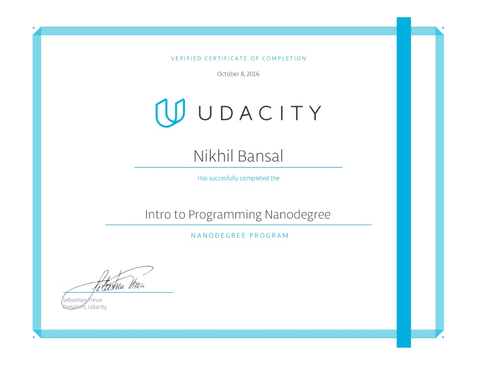

# INTRO-TO-PROGRAMMING-NANODEGREE
Intro to Programming Nanodegree has 5 Projects : 
# Project 1 : 
In this project we have to make simple notes using the html concepts.
# Project 2 : 
In this project we have to make notes using html and css.
# Project 3 : 
In this project we have to build Madlibs game.
# Project 4 : 
In this project we have to built a Movie Trailer Webpage using html,css and python.
# Project 5 : 
In this project we have to option to work on projects like Front End or Android App Development or Data Analysis etc. I have made and Android App. It is a simple business card which describes a local business and givs information like th Address,Description,Phone No.
##Nanodegree Certificate:

